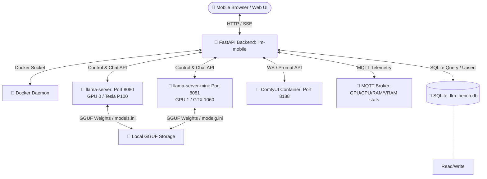

# 📱 LLM Server Manager Mobile (llmMobile)
> A premium, mobile-first control center, streaming chat interface, image pipeline, and automated AI-as-a-Judge benchmarking suite for local GGUF models.

---

## 🔍 Overview

**llmMobile** is a high-fidelity, responsive Single Page Application (SPA) designed to manage local LLM inference engines and image generation pipelines on modern GPU infrastructures (such as Nvidia Tesla P100 + GTX 1060). It features a modular Python/FastAPI backend, a reactive Lit-based frontend, and integrations with `llama.cpp` (`llama-server`/`llama-server-mini`) and `ComfyUI` Docker containers.



---

## 🚀 Key Features

### 1. 🧠 Dual LLM Orchestration & Server Control
* **Multi-Server Management:** Independently start, stop, restart, and monitor health of **two `llama-server` instances** — primary (Tesla P100, port 8080) and secondary (GTX 1060, port 8081).
* **Per-Server Model Control:** Each server has its own model preset INI file (`models.ini` for primary, `modelg.ini` for secondary) with full load/unload, scan, and delete capabilities.
* **Stream Logs:** Live container output streaming from either server directly in the UI.

### 2. 💬 Interactive Streaming Chat
* **Server Selector:** Choose which `llama-server` instance to chat with via pill buttons at the top of the Chat tab. Currently loaded model name is displayed inline.
* **Model Selector:** Dropdown to switch models directly from the Chat tab, with a glow-until-ready loading indicator while the new model loads. The 🛠️ Tools toggle defaults to **OFF**.
* **SSE Streaming:** Real-time token-by-token delivery via Server-Sent Events (SSE), with support for `reasoning_content` from reasoning models.
* **Tool-Enabled Chat:** Toggle 🛠️ Tools ON/OFF to give the model access to **web search** (via DuckDuckGo using `curl_cffi` browser impersonation), **read/write/edit files** in a sandboxed workspace (`/mnt/dashboard/`). Orchestrated server-side with up to 10 tool iterations.
* **Thinking Box:** A 🧠 **Thinking Process...** box displays immediately when a message is sent, showing either the model's real-time `reasoning_content` (for DeepSeek-R1 style models) or a "Formulating thoughts..." placeholder until the response arrives.
* **Rich Text Rendering:** Full Markdown, inline code blocks, numbered lists, and clickable URLs parsed on-the-fly with styled `<a>` tags.
* **Per-Prompt Image Generation:** When the model outputs image prompts (lines starting with `>`), each prompt gets a 🎨 button that saves it to `localStorage` and switches to the Generator tab.
* **Vision Support:** Automatic detection of mmproj/vision models on the selected server, enabling image upload and multimodal chat.
* **Context Preservation:** Interactive chat history management saved to `localStorage`.

### 3. 🎨 ComfyUI Image Pipeline
* **Dynamic Parameter Tuning:** Slider controls for steps, cfg scale, denoise strength, sampler selection, and resolutions.
* **Workflow Selection:** Choose among **z-image-turbo**, **krea2-turbo**, **boogu-turbo**, and **krea2-edit** workflows — or tick multiple checkboxes to run several workflows in one batch.
* **Krea2 Identity Edit:** Load one image for text-guided editing, or two images to transfer a subject from image B into image A (steps slider 4–12).
* **Batch Generation:** Trigger single or multiple image generation requests.
* **On-Demand Lifecycle:** ComfyUI auto-starts when you submit a generation and auto-stops after **10 minutes idle** (watchdog). A status chip on the Generator tab shows `off` / `starting` / `ready` with manual Start/Stop buttons (4s polling).
* **Interactive Local Gallery:** Premium responsive layout with full-screen viewer (mobile lightbox), zoom capabilities, and generation metadata inspector.

### 4. 📊 Automated AI-as-a-Judge Benchmarking
The system features an automated, background-scheduled 5-round evaluation suite:
* **Knowledge QA:** Audits factual correctness regarding Bangkok's full name, Thai script, and translations.
* **Technical Reasoning:** Examines llama.cpp dynamic KV cache allocation mechanics (PagedAttention vs static buffers).
* **Code Generation:** Evaluates async Python scrapers with token bucket rate limiters, backoff, and connection pooling.
* **Abstract Logic:** Solves multi-step matrix rotations and reflections mathematically.
* **Creative Writing:** Generates cyberpunk network engineer sci-fi short stories.
* **The AI Judge:** Grades outputs using ground-truth rubrics in `answers1.json` / `answers2.json`. Includes a **resilient strip-think parser** to gracefully strip `<think>...</think>` tags generated by reasoning models (like DeepSeek-R1) before JSON parsing.
* **Empty Response Retry:** If the test model returns an empty response (e.g., hitting its token limit during long-form rounds), the system automatically retries up to 3 times with a 5-second pause between attempts. Server errors (non-200 HTTP responses) do not trigger retries — they are logged as-is.
* **Queue Benchmarking:** Automatically loads, tests, grades, and switches back and forth between test models and the designated Judge model to keep VRAM footprints clean.
* **Temperature Sweep:** Test the currently loaded model across multiple temperatures (defaults: 0.2, 0.4, 0.6, 0.8, 1.0) on a fixed prompt, grade each run with the AI Judge, and compare scores by temperature.
* **Telegram Notifications:** When a benchmark queue finishes, an optional Telegram message is sent — set `TELEGRAM_BOT_TOKEN` + `TELEGRAM_CHAT_ID` in `.env`.
* **Low-Speed Abort Info:** When a model is aborted for low throughput, the reason is stored in the DB and surfaced in model details.
* **The 3 Strict Quality Filters:**
  1. *Speed:* Average throughput $\ge 20$ tokens per second.
  2. *Hallucination:* Zero factual hallucinations flagged by the Judge in Round 1 and Round 4.
  3. *Quality:* Cumulative qualitative + speed score $\ge 50$ out of 100 points.

### 5. 📡 MQTT-Powered System Metrics
* **Multi-GPU Telemetry:** CPU/GPU temperature, utilization, RAM, VRAM, and storage stats sourced exclusively from Home Assistant via MQTT.
* **Per-GPU Breakdown:** Separate metrics for Tesla P100 and GTX 1060 (temperature, utilization, VRAM usage).

---

## 🛠️ Technology Stack

### Backend
* **Core Framework:** Python 3.11 with **FastAPI** & **Uvicorn**
* **Database:** **SQLite3** for benchmark storage and telemetry
* **Container Management:** **Docker SDK for Python**
* **Async Network Client:** **httpx**
* **Schemas:** **Pydantic v2**
* **Messaging:** **MQTT** (Paho client) for hardware telemetry

### Frontend
* **UI Components:** **Lit** (Reactive Web Components)
* **Build System:** **Vite** (Next-gen frontend tooling)
* **Styling:** Premium vanilla CSS variables, glassmorphism, responsive grid layouts, and active micro-animations
* **Routing:** Single-page view router in Lit

---

## 📂 Repository Layout

```
llmMobile/
├── app/
│   └── main.py                   # Thin FastAPI router — delegates all logic to services/
├── services/                     # Backend service layer (modular business logic)
│   ├── docker_svc.py             # Container lifecycle & MQTT system stats
│   ├── model_svc.py              # Model loading, scanning, INI management (primary + mini)
│   ├── chat_svc.py               # Streaming chat orchestration (primary + mini)
│   ├── sse_svc.py                # Server-Sent Event management
│   ├── comfy/                    # ComfyUI image pipeline (sub-package)
│   │   ├── __init__.py, client.py, workflow.py, comfyio.py
│   │   ├── queue_state.py, worker.py, api.py, lifecycle.py
│   ├── download/                 # Model download queue (sub-package)
│   │   ├── __init__.py, state.py, hf.py, worker.py, api.py
│   ├── benchmark/                # Benchmark execution & scoring (sub-package)
│   │   ├── __init__.py, logging.py, state.py, runner.py, reader.py, api.py
│   ├── judge/                    # AI-as-a-Judge evaluation (sub-package)
│   │   ├── __init__.py, gold.py, judge.py
│   ├── gallery_svc.py            # Image gallery CRUD & metadata
│   ├── push_svc.py               # Push notification service
│   ├── vram_svc.py               # VRAM capture & idle-trigger detection
│   └── tools/                    # Tool-enabled chat orchestration (sub-package)
│       ├── __init__.py, registry.py
│       ├── executor.py           # execute_tool_call() — web search, file ops
│       └── chat.py               # chat_with_tools() — tool loop + streaming final response
├── utils/                        # Shared utilities
│   ├── common.py                 # Constants, paths, helpers
│   ├── db_utils.py               # SQLite connection & transaction helpers
│   └── bench_log.py              # Benchmark logging & rotation
├── models/
│   └── requests.py               # Pydantic request schemas
├── tests/                        # Automated verification (Phase H)
│   ├── conftest.py
│   └── test_endpoints.py
├── main.py                       # Re-exports app for Uvicorn
├── mcp_server/                   # MCP server (FastMCP tools for LLM agent access)
│   ├── server.py                 # FastMCP server entry point (port 8002)
│   ├── utils.py                  # Shared helpers (VRAM/disk/state checks)
│   └── tools/                    # 32 guarded tool implementations
│       ├── model_tools.py        # Model load/unload/delete/list
│       ├── download_tools.py     # HuggingFace download with disk checks
│       ├── benchmark_tools.py    # Benchmark run/queue/sweep
│       ├── generation_tools.py   # Image generation queue
│       ├── gallery_tools.py      # Gallery browse/delete/create
│       ├── server_tools.py       # Server lifecycle + stats
│       └── config_tools.py       # INI config read/write
├── docker-entrypoint.sh          # Launches FastAPI + MCP background worker
├── Dockerfile                    # Multi-stage Dockerfile (Vite build + Python env)
├── package.json                  # Frontend dependencies & Vite scripts
├── requirements.txt              # Python dependencies (includes mcp)
├── PROMPTS/                      # Predefined prompt templates
├── public/                       # Static frontend assets
├── src/                          # Frontend source code (Lit + Vite)
│   ├── index.css                 # Core design tokens & animations
│   ├── llm-app/                  # SPA shell (styles, router, templates, SSE)
│   ├── assets/                   # Centralized SVG icons
│   ├── components/               # Lit web components
│   │   ├── _primitives.js        # Shared CSS primitives
│   │   ├── _confirm.js           # Async confirm-dialog primitive
│   │   ├── data-table.js         # Generic sortable/paginated data table
│   │   ├── toast-host.js         # Global toast notification singleton
│   │   ├── server-status-card.js # Dual-server status with Start/Stop/Restart
│   │   ├── models-config-editor.js # Generic INI editor (models.ini / modelg.ini)
│   │   ├── model-downloader.js   # HuggingFace search & download queue
│   │   ├── server-logs.js        # Multi-container live log viewer
│   │   ├── server-tab/           # Server tab orchestrator (styles, logic, templates)
│   │   ├── chat-tab/             # Chat tab (styles, logic, templates)
│   │   ├── generator-tab/        # ComfyUI prompt & parameter console
│   │   ├── gallery-tab/          # Image gallery & inspector
│   │   └── benchmark-tab/        # Benchmark tab (table, runner, bubble chart)
│   └── utils/
│       ├── api.js                # Centralized fetch wrapper
│       ├── polling.js            # Polling mixin with concurrency guards
│       ├── state-mixin.js        # Loading/error state mixin
│       ├── toast.js              # Toast.show() static service
│       └── op-queue.js           # Offline operation queue
└── AGENTS.md                     # AI Agent coding guidelines
```

---

## 🏗️ Multi-Server Architecture

The app manages two independent `llama-server` instances:

| Server | Container | Port | GPU | INI File | Role |
|---|---|---|---|---|---|
| **Primary** | `llm-server` | 8080 | GPU 0 (Tesla P100) | `models.ini` | Main inference server |
| **Secondary** | `llm-server-mini` | 8081 | GPU 1 (GTX 1060) | `modelg.ini` | Secondary / lightweight models |

Both servers share the same `/models` volume but maintain separate model preset configurations.

---

## 🚥 Quick Start & Run Guides

### Option A: Local Development Run (Frontend + Backend)

#### 1. Start Frontend (Vite)
```bash
cd /home/nui/dev/llmMobile
npm install
npm run dev
```
Frontend dev server at `http://localhost:5173`.

#### 2. Run Backend (FastAPI)
```bash
pip install -r requirements.txt
uvicorn main:app --reload --port 8000
```
Backend server at `http://localhost:8000`.

---

### Option B: Deploying inside Docker Compose (Recommended)

```bash
cd /home/nui/llmaCPP
docker compose build llm-mobile
docker compose up -d --force-recreate llm-mobile
```
Mobile portal at `http://localhost:8000`.

---

## 📡 API Reference Highlight

### Server Management
| Endpoint | Method | Description |
|---|---|---|
| `/status` | `GET` | Retrieves state of both `llama-server` instances and `llm-mobile` |
| `/system_stats` | `GET` | System telemetry (CPU/GPU/RAM/VRAM via MQTT) |
| `/servers/{name}/start` | `POST` | Start a managed server by name |
| `/servers/{name}/stop` | `POST` | Stop a managed server by name |
| `/servers/{name}/restart` | `POST` | Restart a managed server by name |
| `/api/logs` | `GET` | Container logs (supports all containers) |

### Model Management (Primary / `models.ini`)
| Endpoint | Method | Description |
|---|---|---|
| `/models` | `GET` | List models from `models.ini` |
| `/api/models_ini` | `GET` | Raw content of `models.ini` |
| `/api/models_ini` | `POST` | Save `models.ini` content |
| `/api/llm/models` | `GET` | Active model status on primary server |
| `/api/llm/models/load` | `POST` | Load a model on primary server |
| `/api/llm/models/unload` | `POST` | Unload model from primary server |
| `/api/models/scan_and_register` | `POST` | Scan disk and auto-add to `models.ini` |
| `/models/{filename}` | `DELETE` | Delete model file + clean `models.ini` |

### Model Management (Secondary / `modelg.ini`)
| Endpoint | Method | Description |
|---|---|---|
| `/models-mini` | `GET` | List models from `modelg.ini` |
| `/api/models_mini_ini` | `GET` | Raw content of `modelg.ini` |
| `/api/models_mini_ini` | `POST` | Save `modelg.ini` content |
| `/api/llm-mini/models` | `GET` | Active model status on secondary server |
| `/api/llm-mini/models/load` | `POST` | Load a model on secondary server |
| `/api/llm-mini/models/unload` | `POST` | Unload model from secondary server |
| `/api/models-mini/scan_and_register` | `POST` | Scan disk and auto-add to `modelg.ini` |
| `/models-mini/{filename}` | `DELETE` | Delete model file + clean `modelg.ini` |

### Chat
| Endpoint | Method | Description |
|---|---|---|
| `/api/chat/completions` | `POST` | Stream chat from primary server (supports `tools` param for tool calling) |
| `/api/chat-mini/completions` | `POST` | Stream chat from secondary server (supports `tools` param for tool calling) |

> **Tool calling:** When the request body includes a `tools` array, the backend switches to server-side orchestration mode. Tool rounds use non-streaming requests for proper tool-call detection; the *final* assistant response is always streamed token-by-token with full `reasoning_content` preservation.

### Vision
| Endpoint | Method | Description |
|---|---|---|
| `/models/vision-capabilities` | `GET` | mmproj/vision detection on primary server |
| `/models-mini/vision-capabilities` | `GET` | mmproj/vision detection on secondary server |

### Benchmarks
| Endpoint | Method | Description |
|---|---|---|
| `/api/benchmarks` | `GET` | Queries SQLite. Returns ranked list with **3 Quality Filters** applied |
| `/api/benchmarks/run` | `POST` | Starts a background automated 5-round benchmark sequence |
| `/api/benchmarks/judge` | `POST` | Sequentially scores a target run using the AI Judge model |
| `/api/benchmarks/status` | `GET` | Returns live telemetry of the current active run or queue progress |
| `/api/benchmarks/queue/run` | `POST` | Launches batch queue testing and automatic scoring |
| `/api/benchmarks/temperature-sweep` | `POST` | Runs a temperature sweep on the loaded model (background) |

### Generation
| Endpoint | Method | Description |
|---|---|---|
| `/api/generate/queue` | `GET` `POST` `DELETE` | ComfyUI generation queue management |
| `/api/generate/edit` | `POST` | Krea2 identity edit (multipart: prompt, steps, image_a, optional image_b) |
| `/api/comfy/free` | `POST` | Free ComfyUI VRAM cache |
| `/api/comfyui/status` | `GET` | ComfyUI container + HTTP readiness (`off`/`starting`/`ready`), idle seconds, auto-stop countdown |
| `/api/comfyui/start` | `POST` | Start the ComfyUI container on demand |
| `/api/comfyui/stop` | `POST` | Stop the ComfyUI container |

### MCP Server (for LLM Agent Access)
| Tool Name | Description | Safety Guardrails |
|---|---|---|
| `list_models` | List all GGUF models on disk | — |
| `load_model` | Load a model onto a server | ✅ VRAM check, ✅ state conflict check, ✅ file existence |
| `unload_model` | Unload current model from server | ✅ Verify unload via polling |
| `delete_model` | Permanently delete a model file | ✅ Requires `confirm=True`, ✅ checks if loaded |
| `download_model` | Download from HuggingFace | ✅ Disk space check, ✅ duplicate check |
| `run_benchmark` | Run 5-round benchmark | ✅ State conflict check, ✅ model loaded check |
| `run_benchmark_queue` | Run multi-model benchmark queue | ✅ All models exist check, ✅ estimated time |
| `generate_image` | Queue image generation | ✅ Prompt validation, ✅ num_images clamp |
| `delete_gallery_images` | Delete gallery images | ✅ Requires `confirm=True` |
| `start_server` / `stop_server` / `restart_server` | Server lifecycle | ✅ Benchmark conflict check on stop/restart |
| `save_ini_config` | Save server configuration | ✅ INI syntax validation |

> **MCP Port:** The MCP SSE server runs on **port 8002** inside the container. Start via `python mcp_server/server.py`. See `mcp_server/` for the full tool registry.

---

## 🔒 Critical

* **Build Safety:** Always run `npm run build` after any frontend change. Fix all Vite/Lit errors before considering work complete.
* **Docker Rebuild Required:** Code changes are not hot-reloaded in production. Use `docker compose build llm-mobile && docker compose up -d --no-deps llm-mobile` to deploy.
* **MQTT Only:** System stats must come from MQTT. Do not reintroduce local `nvidia-smi` or `psutil` queries for telemetry.
* **Database Idempotency:** Benchmark re-runs must prune historical `test_runs` and rely on `ON DELETE CASCADE` for related tables.

---

## 📜 Full Roadmap

This repository implements the complete roadmap for the `llmMobile` project:

### Backend Modularization (Phases A–H)
- **Phase A – Baseline & Guard Rails**: Setup automated verification via `tests/` and Docker build pipeline.
- **Phase B – Pure Utilities**: Extracted constants, helpers, DB utilities.
- **Phase C – Service Layer (Docker & Model)**: Created `docker_svc.py`, `model_svc.py`.
- **Phase D – Service Layer (Chat & SSE)**: Added `chat_svc.py`, `sse_svc.py`.
- **Phase E – Service Layer (ComfyUI, Queue, Gallery, Push)**: Built `comfy_svc.py`, `queue_svc.py`, `gallery_svc.py`, `push_svc.py`.
- **Phase F – Service Layer (Download, Benchmark, Judge)**: Added `download_svc.py`, `benchmark_svc.py`, `judge_svc.py`.
- **Phase G – Thin Router**: `app/main.py` refactored into a pure façade delegating to services.
- **Phase H – Automated Verification**: Added comprehensive endpoint tests and verified Docker builds.

### Frontend Refactor (Phase I)
- **Phase I – Component Extraction**: Decomposed monolithic tabs into reusable primitives (`_primitives.js`, `_confirm.js`, `_data-table.js`, `toast-host.js`), shared utilities (`utils/api.js`, `utils/polling.js`, `utils/state-mixin.js`), and clean child-component trees for `server-tab` and `benchmark-tab`. Centralized icons in `assets/icons.js`.

### Large-File Modularization (Phase J)
- **Phase J – Sub-package & Sub-folder Splits**: Centralized `get_quantization_from_name` in `utils/common.py`. Split `download_svc.py` → `services/download/`, `comfy_svc.py` → `services/comfy/`, `benchmark_svc.py` → `services/benchmark/`, `judge_svc.py` → `services/judge/`. Split all large Lit components into `_styles.js`/`_logic.js`/`_templates.js` sub-folder pattern.

### Multi-Server Support (Phase K)
- **Phase K – Dual llama-server Management**: Added per-server status/control (Start/Stop/Restart) for both `llama-server` and `llama-server-mini`. Full model management for both servers including separate INI files (`models.ini` / `modelg.ini`), model load/unload, scan/delete. Chat server selector with dual streaming endpoints. GTX secondary GPU telemetry via MQTT. Vision capability detection on both servers.

### Tool-Enabled Chat (Phase L)
- **Phase L – Tool-Calling & Streaming Improvements**: Implemented server-side tool/function-calling orchestration in `services/tools/`. 4 tools (web search via DuckDuckGo/`curl_cffi`, read/write/edit file in `/mnt/dashboard/` sandbox). Tool rounds non-streaming; final response streamed token-by-token with `reasoning_content` preservation. Frontend: thinking box (`!response && !m.done`), URL clickability, per-prompt 🎨 image generation buttons, service worker cache management.

### Live Server Activity & Further Code Splitting (Phase M)
- **Phase M – Chat-tab Logic Splitting & Inference Activity Indicator**: Further split `chat-tab/_logic.js` (923 → 35 lines) into `_tools.js`, `_formatting.js`, and `_api.js` with barrel re-export. Added live `○ Idle`/`● Inferring…` per-server activity badge via llama-server `/slots` endpoint, polled every 2.5s. All repository source files are now under 550 lines.

### MCP Server Integration (Phase N)
- **Phase N – MCP Server for Safe LLM Agent Access**: Added `mcp_server/` package with 32 guarded FastMCP tools wrapping all FastAPI endpoints. Background worker on port 8002 with pre-flight validation (VRAM, disk, state) and post-flight verification. See `MCPnSkills.md` for the implementation plan.

### On-Demand ComfyUI Lifecycle & Image Workflow Expansion (Phase O)
- **Phase O – On-Demand ComfyUI Lifecycle & Image Workflow Expansion**: ComfyUI is now started/stopped on demand via the Docker SDK (`services/comfy/lifecycle.py`) with HTTP readiness probing and a **10-minute idle watchdog** that auto-stops the container. Queue worker auto-starts ComfyUI on submit; Generator tab has a status chip + Start/Stop. Added **Krea2 Identity Edit** (single/dual image), **Boogu Image Turbo** T2I, and checkbox multi-workflow batch selection.

### Benchmark & UX Enhancements (Phase P)
- **Phase P – Benchmark & UX Enhancements**: Temperature Sweep with JSON-retry grading, Telegram notifications on queue completion, low-speed abort info in DB, Chat tab model selector with glow-until-ready indicator, Tools toggle default OFF, gallery mobile lightbox, floating ⚡ hard-refresh (PWA cache-bust) button, MCP port moved to 8002.

### MQTT Telemetry Resilience (Phase Q)
- **Phase Q – Self-Healing MQTT Telemetry**: Hardened the MQTT telemetry pipeline after Server-tab VRAM bars froze at stale values (paho `loop_start()` thread died silently). `_start_mqtt_listener()` now tears down stale clients, registers `on_connect`/`on_disconnect` logging, enables paho auto-reconnect (`reconnect_delay_set(1, 30)`), and configures the `paho.mqtt` logger. Added `start_mqtt_watchdog()` (daemon thread) that restarts the listener after 90s without telemetry (checked every 30s). Stats remain **exclusively MQTT** — no `nvidia-smi`/`psutil` fallback.
