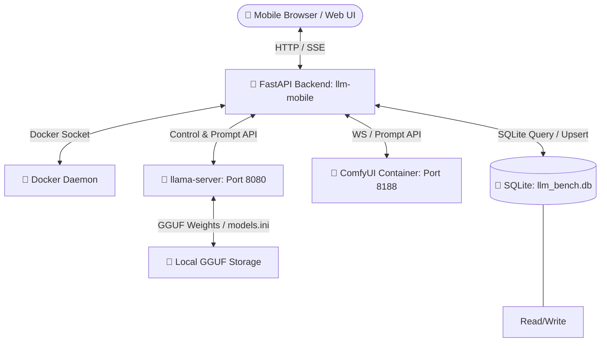

# 📱 LLM Server Manager Mobile (llmMobile)
> A premium, mobile-first control center, streaming chat interface, image pipeline, and automated AI-as-a-Judge benchmarking suite for local GGUF models.

---

## 🔍 Overview

**llmMobile** is a high-fidelity, responsive Single Page Application (SPA) designed to manage local LLM inference engines and image generation pipelines on modern GPU infrastructures (such as Nvidia Tesla P100 / RTX). It features a modular Python/FastAPI backend, a reactive Lit-based frontend, and integrations with `llama.cpp` (`llama-server`) and `ComfyUI` Docker containers.



---

## 🚀 Key Features

### 1. 🧠 LLM Orchestration & Server Control
* **Container Management:** Directly start, stop, restart, and monitor health of `llama-server` via the Docker SDK.
* **Stream Logs:** Live container output streaming directly in the UI.
* **Router Mode / models.ini Integration:** Dynamically inspect, edit, save, reload `models.ini`, and delete model weights. Automatically handles cascading deletions inside the configuration file.

### 2. 💬 Interactive Streaming Chat
* **SSE Streaming:** Real-time token delivery via Server-Sent Events (SSE).
* **Rich Text Rendering:** Full Markdown, inline code blocks, and lists parsed on-the-fly.
* **Context Preservation:** Interactive chat history management.

### 3. 🎨 ComfyUI Image Pipeline
* **Dynamic Parameter Tuning:** Slider controls for steps, cfg scale, denoise strength, sampler selection, and resolutions.
* **Batch Generation:** Trigger single or multiple image generation requests.
* **Interactive Local Gallery:** Premium responsive layout with full-screen viewer, zoom capabilities, and generation metadata inspector.

### 4. 📊 Automated AI-as-a-Judge Benchmarking
The system features an automated, background-scheduled 5-round evaluation suite:
* **Knowledge QA:** Audits factual correctness regarding Bangkok's full name, Thai script, and translations.
* **Technical Reasoning:** Examines llama.cpp dynamic KV cache allocation mechanics (PagedAttention vs static buffers).
* **Code Generation:** Evaluates async Python scrapers with token bucket rate limiters, backoff, and connection pooling.
* **Abstract Logic:** Solves multi-step matrix rotations and reflections mathematically.
* **Creative Writing:** Generates cyberpunk network engineer sci-fi short stories.
* **The AI Judge:** Grades outputs using ground-truth rubrics in `answers1.json` / `answers2.json`. Includes a **resilient strip-think parser** to gracefully strip `<think>...</think>` tags generated by reasoning models (like DeepSeek-R1) before JSON parsing.
* **Empty Response Retry:** If the test model returns an empty response (e.g., hitting its token limit during long-form rounds), the system automatically retries up to 3 times with a 5-second pause between attempts. Server errors (non-200 HTTP responses) do not trigger retries — they are logged as-is.
* **Queue Benchmarking:** Automatically loads, tests, grades, and switches back and forth between test models and the designated Judge model to keep VRAM footprints clean.
* **The 3 Strict Quality Filters:**
  1. *Speed:* Average throughput $\ge 20$ tokens per second.
  2. *Hallucination:* Zero factual hallucinations flagged by the Judge in Round 1 and Round 4.
  3. *Quality:* Cumulative qualitative + speed score $\ge 50$ out of 100 points.

---

## 🛠️ Technology Stack

### Backend
* **Core Framework:** Python 3.11 with **FastAPI** & **Uvicorn**
* **Database:** **SQLite3** for benchmark storage and telemetry
* **Container Management:** **Docker SDK for Python**
* **Async Network Client:** **httpx**
* **Schemas:** **Pydantic v2**

### Frontend
* **UI Components:** **Lit** (Reactive Web Components)
* **Build System:** **Vite** (Next-gen frontend tooling)
* **Styling:** Premium vanilla CSS variables, glassmorphism, responsive grid layouts, and active micro-animations
* **Routing:** Single-page view router in Lit

---

## 📂 Repository Layout

``` llmMobile/
├── app/
│   └── main.py # Thin FastAPI router — delegates all logic to services/
├── services/ # Backend service layer (modular business logic)
│   ├── docker_svc.py # Container lifecycle & system stats
│   ├── model_svc.py # Model loading, scanning, deletion
│   ├── chat_svc.py # Streaming chat orchestration
│   ├── sse_svc.py # Server-Sent Event management
│   ├── comfy_svc.py # ComfyUI image pipeline integration
│   ├── queue_svc.py # Benchmark queue orchestration
│   ├── gallery_svc.py # Image gallery & metadata handling
│   ├── push_svc.py # Push notification service
│   ├── download_svc.py # Model download management
│   ├── benchmark_svc.py # Benchmark run & scoring logic
│   └── judge_svc.py # AI-as-a-Judge evaluation & JSON parsing
├── utils/ # Shared utilities
│   ├── common.py # Constants, paths, helpers
│   ├── db_utils.py # SQLite connection & transaction helpers
│   └── bench_log.py # Benchmark logging & rotation
├── models/
│   └── requests.py # Pydantic request schemas
├── tests/ # Automated verification (Phase H)
│   ├── conftest.py
│   └── test_endpoints.py
├── main.py # Re-exports app for Uvicorn
├── Dockerfile # Multi-stage Dockerfile (Vite build + Python env)
├── package.json # Frontend dependencies & Vite scripts
├── requirements.txt # Python dependencies
├── MyZimage_turbo.json # Turbo Image Generator template
├── PROMPTS # Predefined prompt templates
├── benchmark.md # System implementation plan
├── public/ # Static frontend assets (icons, images)
└── src/ # Frontend source code (Lit + Vite)
    ├── index.css # Core design tokens & animations
    ├── llm-app.js # SPA shell, view router, SSE client, toast host
    ├── assets/
    │   └── icons.js # Centralized SVG icon set
    ├── components/ # Lit web components
    │   ├── _primitives.js # Shared CSS primitives (card, buttons, etc.)
    │   ├── _confirm.js # Async confirm-dialog primitive
    │   ├── _data-table.js # Generic sortable/paginated data table
    │   ├── server-tab.js # Thin orchestrator for server sub-components
    │   ├── server-status-card.js # Status display & start/stop/restart
    │   ├── models-config-editor.js # models.ini editor with save/scan/delete
    │   ├── model-downloader.js # Model search & download queue UI
    │   ├── server-logs.js # Live log viewer with auto-scroll
    │   ├── chat-tab.js # Streaming chat interface
    │   ├── generator-tab.js # ComfyUI prompt & parameter console
    │   ├── gallery-tab.js # Responsive image gallery & inspector
    │   ├── toast-host.js # Global toast notification singleton
    │   ├── benchmark-tab.js # Thin orchestrator for benchmark sub-components
    │   ├── benchmark-table.js # Sortable/filterable benchmark results
    │   ├── benchmark-runner.js # Queue builder & live progress tracker
    │   └── models-config.js # Database inspector & file management
    └── utils/
        ├── api.js # Centralized fetch wrapper with toast/loading support
        ├── polling.js # Polling mixin/hook with concurrency guards
        ├── state-mixin.js # Loading/error state mixin
        └── toast.js # Toast.show() static service
```

---

## 🚥 Quick Start & Run Guides

### Option A: Local Development Run (Frontend + Backend)

#### 1. Start Frontend (Vite)
Ensure you have Node.js (v20+) installed:
```bash
cd /home/nui/dev/llmMobile
npm install
npm run dev
```
The frontend dev server will start at `http://localhost:5173`.

#### 2. Run Backend (FastAPI)
Ensure you have python-3.11/pip installed:
```bash
pip install -r requirements.txt
uvicorn main:app --reload --port 8000
```
The backend server will start at `http://localhost:8000`.

---

### Option B: Deploying inside Docker Compose (Recommended)

This repository is pre-integrated into the main `llmaCPP` stack. To rebuild and deploy the mobile manager container:
```bash
# Navigate to the main compose stack
cd /home/nui/llmaCPP

# Rebuild and recreate the container
docker compose build llm-mobile
docker compose up -d --force-recreate llm-mobile
```
The mobile portal will be live at `http://localhost:8000`.

---

## 📡 API Reference Highlight

| Endpoint | Method | Description |
|---|---|---|
| `/api/server/status` | `GET` | Retrieves the current state of `llama-server` |
| `/api/server/start` | `POST` | Triggers container startup via Docker SDK |
| `/api/server/stop` | `POST` | Stops container via Docker SDK |
| `/api/models` | `GET` | Scans `models.ini` and physical files in `/models` |
| `/api/models/load` | `POST` | Switches active model loaded inside `llama-server` |
| `/api/benchmarks` | `GET` | Queries SQLite. Returns ranked list with the **3 Quality Filters** applied |
| `/api/benchmarks/run` | `POST` | Starts a background automated 5-round benchmark sequence |
| `/api/benchmarks/judge` | `POST` | Sequentially scores a target run using the AI Judge model |
| `/api/benchmarks/status` | `GET` | Returns live telemetry of the current active run or queue progress |
| `/api/benchmarks/queue/run` | `POST` | Launches batch queue testing and automatic scoring |

---

## 🔒 Guidelines for System Modifiers

* Always keep the frontend build-safe. Verify changes by executing `npm run build` locally or inside the multi-stage Docker workflow.
* Always preserve database transaction safety when performing idempotent upserts or cascading deletions during re-testing.
* Ensure all database locks inside Python are handled using asynchronous primitives (`asyncio.Lock()`) to prevent deadlock starvation during sequential model swaps.

---

## 🏗️ Architectural Evolution

### Phase G — Thin Router & Service Layer

The core backend (`app/main.py`) has been refactored into a **thin router**. All functional logic now resides in dedicated service modules under `services/`. This fully modularizes the codebase, improves testability, and enforces strict separation of concerns.

Phase H verification tests have been added to ensure endpoint contract compliance.

### Phase I — Frontend Component Refactor

The monolithic frontend tabs have been decomposed into a library of reusable, single-responsibility components:
- **Shared Primitives:** `_primitives.js` consolidates CSS (cards, buttons, pills, modals) into one source of truth.
- **Generic Widgets:** `_data-table` (sort/paginate), `_confirm` (async confirmation), `toast-host` (global notifications).
- **Split Tabs:** `server-tab` and `benchmark-tab` are now thin orchestrators composing child elements (`<server-status-card>`, `<models-config-editor>`, `<model-downloader>`, `<server-logs>`, `<benchmark-table>`, `<benchmark-runner>`).
- **Shared Utilities:** `utils/api.js` centralizes fetch logic with built-in toast/loading support; `utils/polling.js` manages safe async intervals; `utils/state-mixin.js` standardizes loading/error state patterns.
- **Asset Centralization:** `assets/icons.js` replaces inline SVGs across every component.

All changes are build-safe (`npm run build` passes), visually pixel-identical to the pre-refactor baseline, and fully backward-compatible with existing backend APIs.

---

## 📜 Full Roadmap

This repository implements the complete roadmap for the `llmMobile` project:

### Backend Modularization (Phases A–H)
- **Phase A – Baseline & Guard Rails**: Setup automated verification via `tests/` and Docker build pipeline.
- **Phase B – Pure Utilities**: Extracted constants, helpers, DB utilities.
- **Phase C – Service Layer (Docker & Model)**: Created `docker_svc.py`, `model_svc.py`.
- **Phase D – Service Layer (Chat & SSE)**: Added `chat_svc.py`, `sse_svc.py`.
- **Phase E – Service Layer (ComfyUI, Queue, Gallery, Push)**: Built `comfy_svc.py`, `queue_svc.py`, `gallery_svc.py`, `push_svc.py`.
- **Phase F – Service Layer (Download, Benchmark, Judge)**: Added `download_svc.py`, `benchmark_svc.py`, `judge_svc.py`.
- **Phase G – Thin Router**: `app/main.py` refactored into a pure façade delegating to services.
- **Phase H – Automated Verification**: Added comprehensive endpoint tests and verified Docker builds.

### Frontend Refactor (Phase I)
- **Phase I – Component Extraction**: Decomposed monolithic tabs into reusable primitives (`_primitives.js`, `_confirm.js`, `_data-table.js`, `toast-host.js`), shared utilities (`utils/api.js`, `utils/polling.js`, `utils/state-mixin.js`), and clean child-component trees for `server-tab` and `benchmark-tab`. Centralized icons in `assets/icons.js`.

All phases have been completed, resulting in a fully modular, test-covered codebase with strict separation of concerns on both the backend and frontend.
