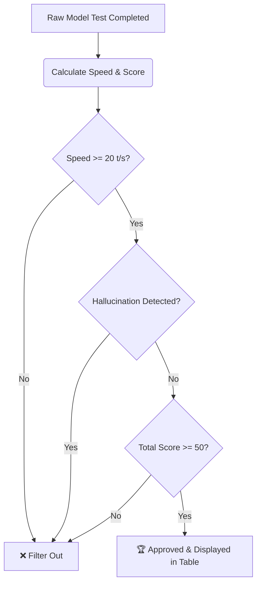

# 📊 Automated LLM Benchmarking & Grading System
## Technical Implementation Plan

This document outlines the research findings and comprehensive implementation plan to build an automated benchmarking, grading (AI-as-a-Judge), filtering, and ranking system for local GGUF models on our Tesla P100 (16GB) infrastructure. 

The system will execute a 5-round benchmark on active models, leverage a designated AI model to grade outputs against gold standard answers, apply strict quality filters, and display passing models in the web application's **Benchmarks** tab using a dynamic SQLite-backed rankings table.

---

## 🔍 1. Current Architecture & Research Findings

Based on an inspection of the workspace, we have discovered the following assets and integrations:

### 🗃️ A. SQLite Database Schema (`llm_bench.db`)
An active SQLite database exists at `/home/nui/llmaCPP/llm_bench.db` (which is mapped to `/app/llm_bench.db` within the docker container context). The schema is structured as follows:

```sql
-- Core model record
CREATE TABLE models (
    model_id TEXT PRIMARY KEY,
    name TEXT NOT NULL,
    quantization TEXT,
    vram_fit TEXT,
    status TEXT DEFAULT 'pending',
    notes TEXT
);

-- Test run records linked to models
CREATE TABLE test_runs (
    run_id TEXT PRIMARY KEY,
    model_id TEXT NOT NULL,
    timestamp TEXT NOT NULL,
    raw_output_path TEXT,
    FOREIGN KEY (model_id) REFERENCES models(model_id) ON DELETE CASCADE
);

-- Individual category scores for each test run (100-point rubric)
CREATE TABLE round_scores (
    id INTEGER PRIMARY KEY AUTOINCREMENT,
    run_id TEXT NOT NULL,
    round_name TEXT NOT NULL,
    score INTEGER,
    reasoning TEXT,
    speed_tps REAL,
    FOREIGN KEY (run_id) REFERENCES test_runs(run_id) ON DELETE CASCADE,
    UNIQUE(run_id, round_name)
);

-- Detected hallucinations for models
CREATE TABLE model_hallucinations (
    id INTEGER PRIMARY KEY AUTOINCREMENT,
    model_id TEXT NOT NULL,
    round_name TEXT NOT NULL,
    description TEXT NOT NULL,
    severity TEXT DEFAULT 'warning',
    FOREIGN KEY (model_id) REFERENCES models(model_id) ON DELETE CASCADE
);
```

### 💻 B. Original Benchmark Script (`modeltest.py`)
The original script at `/home/nui/workspace/llmTest/modeltest.py` contains:
1. **Dynamic Model Discovery:** Calls the local `llama-server` OpenAI-compatible `/v1/models` endpoint to detect the active loaded model ID.
2. **5-Round Evaluation:** Sequentially executes 5 specific prompts via the native `/completion` endpoint:
   - **Round 1: Knowledge QA** (Bangkok's full name, Thai script, and translation)
   - **Round 2: Technical Reasoning** (Dynamic KV cache allocation in llama.cpp)
   - **Round 3: Code Generation** (Highly optimized async/aiohttp URL scraper with token bucket)
   - **Round 4: Abstract Reasoning** (N x N matrix transformations)
   - **Round 5: Creative Writing** (500-word cyberpunk network engineer noir short story)
3. **Metrics Tracking:** Extracts `duration_seconds`, `tokens_generated`, and computes `tokens_per_second` (speed) per round.
4. **Cooldown (10s):** Introduces a 10-second sleep between rounds to prevent cascading VRAM locks and maintain server cooperativeness.
5. **Output Export:** Saves the raw results to `/home/nui/workspace/llmTest/model_test_output/[Model_Name]_test_output.json`.

### 📚 C. Gold Standard Answers (`answers1.json` / `answers2.json`)
The absolute ground-truth answers reside at `/home/nui/llmaCPP/answers1.json` and `/home/nui/llmaCPP/answers2.json`. They contain:
- The target questions and correct responses.
- Explicit **key points** that the model's output must include to receive full points.
- Maximum points allocated per category.

---

## 🎯 2. Specification of the 3 Strict Quality Filters

To maintain a high standard of interactive performance and reliability, any model displayed in the primary **Benchmarks** rankings table must satisfy **all three** of the following criteria:



### 1. Speed Filter: Throughput $\ge 20$ Tokens/Second (t/s)
- **Rationale:** Interactive usage requires a fast pacing. Models generating below 20 t/s feel sluggish and are filtered out of production routing.
- **Implementation:** Calculated as the average `tokens_per_second` across all successful rounds.

### 2. Hallucination Filter: Zero Factual Hallucinations
- **Rationale:** Factual accuracy is non-negotiable for enterprise and agentic workflows.
- **Implementation:** Any model with entries in the `model_hallucinations` table for its active run is immediately filtered out. The AI Judge specifically audits the Knowledge QA response (Bangkok formal name) and Abstract Logic proofs.

### 3. Quality Filter: Total Cumulative Score $\ge 50$ Out of 100
- **Rationale:** Models scoring under 50 exhibit poor reasoning, broken syntax in code generation, or failure to follow prompt instructions.
- **Implementation:** Total score is computed as:
  $$\text{Total Score} = \text{Speed Score (max 25)} + \sum \text{Qualitative Category Scores (max 75)}$$
  Models with a Total Score $< 50$ are hidden from the primary active ranking.

---

## 🔄 3. Overwriting & Retesting Strategy

To maintain a clean and accurate dashboard, the system guarantees **only the latest test result is displayed per model**:

1. **Idempotent Upsert (Overwrite):** When a model is retested (identified by matching `model_id` e.g., derived from its filename like `granite-4.1-8b-q4_k_m`), the new test run, scores, and hallucinations must replace the old records.
2. **Database Cleansing:** To prevent orphaned records, initiating a new benchmark run or importing a new test run for an existing `model_id` will:
   - Identify the previous `run_id` for that `model_id` in `test_runs`.
   - Delete the previous `test_runs` record (cascade delete automatically removes related `round_scores` and `model_hallucinations` via foreign key constraints).
   - Insert the new `test_runs` and score records, preserving database cleanliness.

---

## 🧠 4. AI-as-a-Judge System Design

A designated high-fidelity model (selectable via the UI, defaulting to a highly capable MoE like `Hermes-3-Llama-3.1-8B` or `Qwopus3.6-35B`) will act as the AI Judge to translate raw model responses into qualitative scores and identify hallucinations.

### 📝 A. Gold Standard Grading Prompt Template
The AI Judge is invoked using a detailed system prompt that combines the rubric, the gold standard answer, key points, and the model's output:

````markdown
You are an expert, objective AI Benchmark Judge. Your task is to grade a local LLM's response to a specific benchmark round.
Compare the model's response against the provided Gold Standard and verify which key points were addressed.

### Grading Rubric & Max Points:
- Category: {category_name}
- Max Points: {max_points}

### Gold Standard Ground Truth:
{correct_answer}

### Key Points to Verify:
{key_points_list}

### Model Response Under Test:
"""
{model_response}
"""

### Grading Instructions:
1. Evaluate the model response strictly based on factual accuracy, correctness, and adherence to the key points.
2. Award points up to the maximum ({max_points} pts). Be fair but strict.
3. Deduced scores should be integers.
4. Auditing Hallucinations: 
   - If this is "Round 1: Knowledge QA", check if the model fabricated, invented, or hallucinated facts, spelling, or etymology (e.g. fabricating parts of Bangkok's name, inventing Thai words, or providing wrong English translations).
   - If a hallucination is detected, you MUST set "hallucination_detected" to true and provide a description.

You must return a JSON object exactly matching this structure (do not output any other text or markdown outside of the JSON):
{{
    "score": <integer_score>,
    "reasoning": "<concise_explanation_of_the_assigned_score>",
    "hallucination_detected": <true_or_false>,
    "hallucination_description": "<description_if_detected_else_empty>"
}}
````

### 🛠️ B. Robust Parser for Reasoning/Thinking Models
Reasoning models (like DeepSeek-R1) generate `<think>...</think>` chain-of-thought blocks before outputting their final JSON. This frequently crashes basic parsers.
We will implement a resilient parser in `main.py` that strips thinking blocks and extracts valid JSON objects:

```python
import re
import json

def parse_judge_json(raw_text: str) -> dict:
    # 1. Strip out <think>...</think> blocks if present
    clean_text = re.sub(r'<think>.*?</think>', '', raw_text, flags=re.DOTALL)
    
    # 2. Extract content between the first '{' and the last '}'
    start_idx = clean_text.find('{')
    end_idx = clean_text.rfind('}')
    
    if start_idx == -1 or end_idx == -1:
        raise ValueError("No JSON object could be located in the Judge response")
        
    json_str = clean_text[start_idx:end_idx+1]
    return json.loads(json_str)
```

---

## ⚡ 5. Backend Integration Plan (FastAPI in `main.py`)

We will add three powerful, stateful API endpoints to the backend:

### 1. `POST /api/benchmarks/run`
Triggers an automated benchmark on the currently active `llama-server` model.
- **Process:** Runs as a background task.
- **Workflow:**
  1. Calls `/v1/models` on `llama-server` to discover the loaded `model_id`.
  2. Creates/updates the model entry in the `models` table with status `'testing'`.
  3. Executes the 5-round prompts, gathering metrics (TPS, durations).
  4. Saves raw output JSON to `/home/nui/workspace/llmTest/model_test_output/`.
  5. Auto-triggers the Judge endpoint upon completion.

### 2. `POST /api/benchmarks/judge`
Grades a specific test run using a selected judge model.
- **Arguments:** `{ "run_id": "optional-uuid", "judge_model_id": "model-id-to-use" }`
- **Workflow:**
  1. Identifies the target test run and loads its raw JSON.
  2. Auto-calculates the **Speed Score (max 25)** using the normalized formula:
     $$\text{Speed Score} = \min\left(25, \frac{\text{Average TPS}}{60} \times 25\right)$$
  3. Sequentially prompts the `judge_model_id` via `llama-server` (or external API if configured) to grade the remaining 5 rounds using the ground-truth key points in `answers1.json`.
  4. Parses the JSON output using our robust parser.
  5. Inserts/Overwrites results in `round_scores` and logs hallucinations in `model_hallucinations`.
  6. Updates model status to `'completed'`.

### 3. `GET /api/benchmarks`
Replaces the hardcoded list with a reactive SQLite query. It retrieves rankings and applies the **3 Strict Quality Filters** (unless the user toggles a parameter to inspect failed/filtered models).

#### 🧮 CTE Query for Ranked Models:
```sql
WITH latest_runs AS (
    SELECT tr.model_id, tr.run_id, tr.timestamp,
           ROW_NUMBER() OVER (PARTITION BY tr.model_id ORDER BY tr.timestamp DESC) as rn
    FROM test_runs tr
),
run_scores_agg AS (
    -- Compute total score and retrieve average tokens per second
    SELECT lr.model_id, lr.run_id, lr.timestamp,
           SUM(rs.score) as total_score,
           MAX(CASE WHEN rs.round_name = 'speed_metric' THEN rs.speed_tps END) as avg_tps
    FROM latest_runs lr
    JOIN round_scores rs ON lr.run_id = rs.run_id
    WHERE lr.rn = 1
    GROUP BY lr.model_id, lr.run_id, lr.timestamp
)
SELECT m.model_id, m.name, m.quantization, m.status, m.notes,
       rsa.run_id, rsa.timestamp, rsa.total_score, rsa.avg_tps,
       (SELECT COUNT(*) FROM model_hallucinations mh WHERE mh.model_id = m.model_id) as hallucination_count
FROM models m
JOIN run_scores_agg rsa ON m.model_id = rsa.model_id
ORDER BY rsa.total_score DESC;
```

*In the Python route, we will apply the strict filters before returning the array to the front-end:*
```python
@app.get("/api/benchmarks")
def get_benchmarks(show_all: bool = False):
    # Execute database query ...
    filtered_results = []
    for r in db_results:
        # Extract fields
        avg_tps = r["avg_tps"] or 0
        total_score = r["total_score"] or 0
        hallucinated = r["hallucination_count"] > 0
        
        # Apply 3 filters
        if not show_all:
            if avg_tps < 20.0 or hallucinated or total_score < 50:
                continue
                
        filtered_results.append({
            "model": r["name"],
            "platform": "Tesla P100 (16GB)",
            "quant": r["quantization"] or "Unknown",
            "tokens_sec": round(avg_tps, 1),
            "score": f"{total_score}/100"
        })
    return {"benchmarks": filtered_results}
```

---

## 🎨 6. Frontend Benchmarks UI Integration (`stub-tabs.js`)

We will enhance the **Benchmarks** tab to make it feel extremely premium, responsive, and alive:

1. **Reactive Table Loading:** Binds directly to the updated `/api/benchmarks` endpoint.
2. **Quality-Filter Toggle:** A sleek glassmorphic switch allowing users to toggle between **"Showing Qualified Only"** (default) and **"Show All Tested Models"** (for auditing and debugging).
3. **Trigger Benchmark Panel:** A clean panel showing the currently active server model, a dropdown to select the Judge Model, and a **"🚀 Start Benchmark"** action button.
4. **Real-time Status Overlay:** While a benchmark is running, display a beautiful glowing micro-animation and stream progress logs (e.g. "Running Round 3: Code Generation...") using WebSocket or polling.

---

## 🚀 7. Step-by-Step Implementation Roadmap

We will implement this feature set in 5 incremental, robust, and highly testable phases:

| Phase | Title | Targets & Deliverables | Verification Commands / Tests |
|---|---|---|---|
| **Phase 1** | **Database Integration** | Connect `main.py` to `llm_bench.db`. Implement models upsert helper functions. | `sqlite3 /home/nui/llmaCPP/llm_bench.db` and query schema. |
| **Phase 2** | **Resilient AI Judge** | Add the grading prompt, ground-truth parser, and the robust JSON strip-think parser. | Run mock model responses with `<think>` blocks through the parser to ensure zero crashes. |
| **Phase 3** | **Automated Test Runner** | Implement `POST /api/benchmarks/run` background worker. Execute 5-round sequence. | Run benchmark on active model and verify output JSON is successfully generated in output directory. |
| **Phase 4** | **Filter-Backed Rankings API**| Re-engineer `GET /api/benchmarks` to query DB dynamically and enforce the 3 strict quality filters. | Query `/api/benchmarks` using `curl` and verify failed/hallucinating models are excluded. |
| **Phase 5** | **Aesthetics & UI Polish** | Build the Benchmark Trigger, Judge Selector, and Quality Filter toggle inside `stub-tabs.js`. | Launch `npm run dev`, open Benchmarks tab, and enjoy the premium interface. |

---

> [!IMPORTANT]
> **Plan Verification Status:** Ready for User Review. No database changes, file deletions, or code modifications will occur until this plan is approved and signed off.
